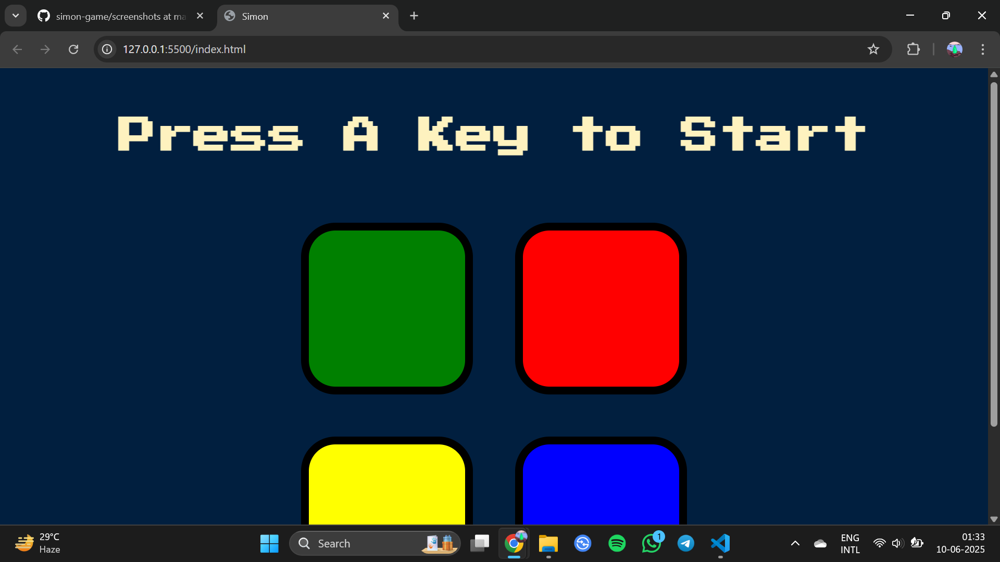
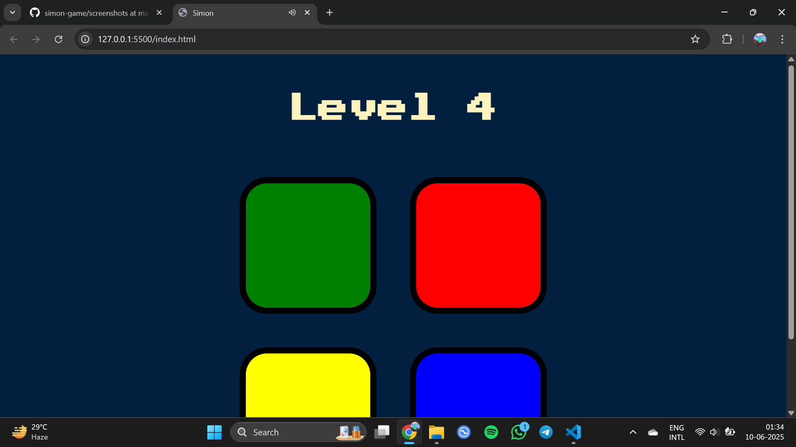
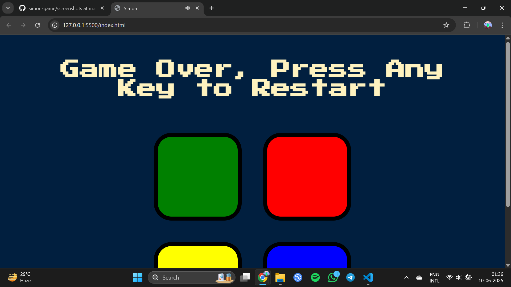

# 🎮 Simon Game

A web-based version of the classic Simon Game built with HTML, CSS, and JavaScript.

## 🚀 How to Play

1. Press any key to start.
2. Watch the color sequence flash.
3. Repeat the pattern by clicking the colored buttons.
4. The game adds a new color to the sequence each round.
5. If you click the wrong button, the game ends.

## 🧠 Features

- Interactive UI with button animations
- Sound feedback for each button
- Tracks and increases level as user progresses
- Game-over effect and restart option

## 🔗 Play It Live

👉 [Click here to play the game](https://aozzb.github.io/simon-game/)  


## 📁 Project Structure

```plaintext
Simon-game/
├── index.html
├── styles.css
├── game.js
└── sounds/
    ├── red.mp3
    ├── blue.mp3
    ├── green.mp3
    ├── yellow.mp3
    └── wrong.mp3
```

## 📷 Screenshots








## 🛠️ Technologies Used

- HTML
- CSS
- JavaScript
- jQuery

## 🙏 Credit

This project was created while following [Angela Yu's Web Development Bootcamp](https://www.udemy.com/course/the-complete-web-development-bootcamp/).  
The HTML and CSS were provided as part of the course — I implemented the JavaScript logic myself to learn how the game works.


## 📬 Contact

Feel free to reach out if you have suggestions or want to collaborate!


